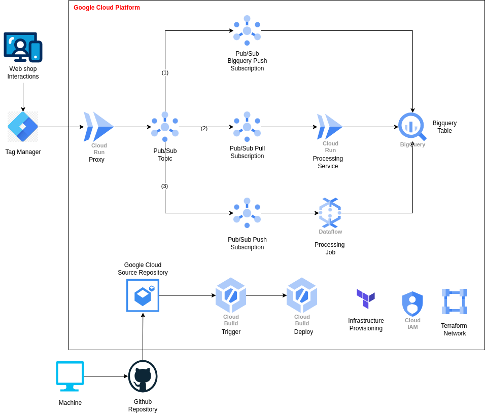

# Data streaming on GCP  

## Table of contents  
<!-- Create the table of content -->

## Enviroment setup  

Install [gcloud CLI](https://cloud.google.com/sdk/docs/install)  
Install [Terraform](https://developer.hashicorp.com/terraform/tutorials/aws-get-started/install-cli)  
  
## Pipeline Architecture  

  

## To do steps  

### Set-up Cloud Enviroment  
  
### Build Cloud Run Containers
  
#### Pub/Sub proxy server container  
  
#### Data Processing service container  

#### Dataflow Template container  
  
### Deploy using Trigger Terraform  

## Preferences  

Big thanks to **@Nucleus Engineering** [hack-your-pipie/01_ingest_and_transform](https://github.com/NucleusEngineering/hack-your-pipe/tree/main/01_ingest_and_transform/11_challenge)  
